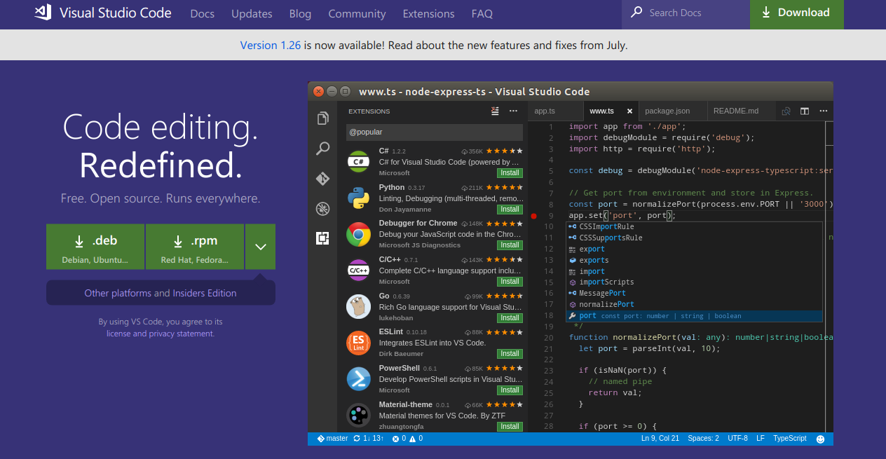
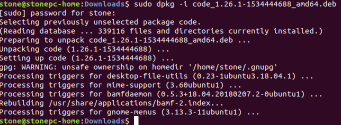
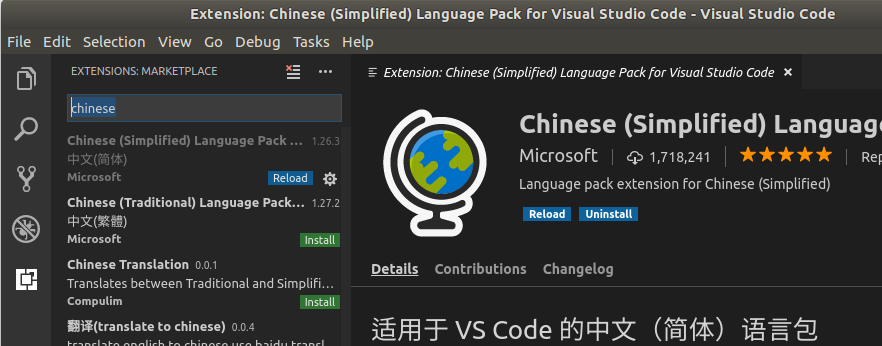
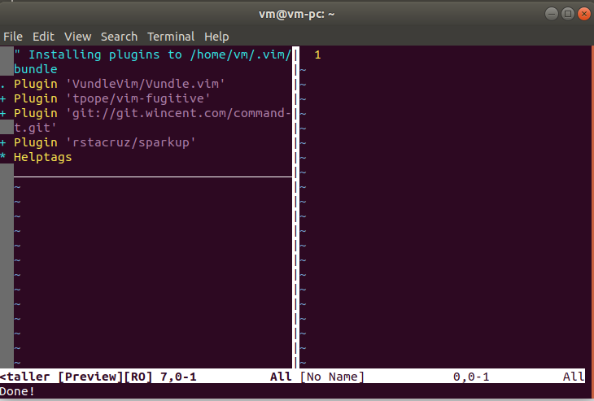
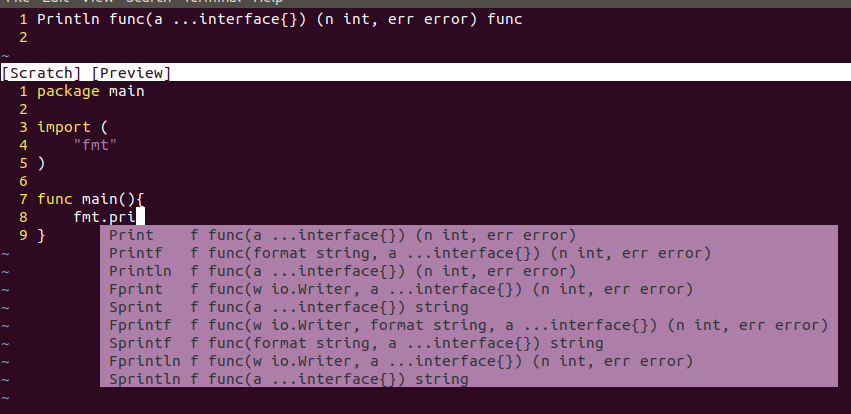
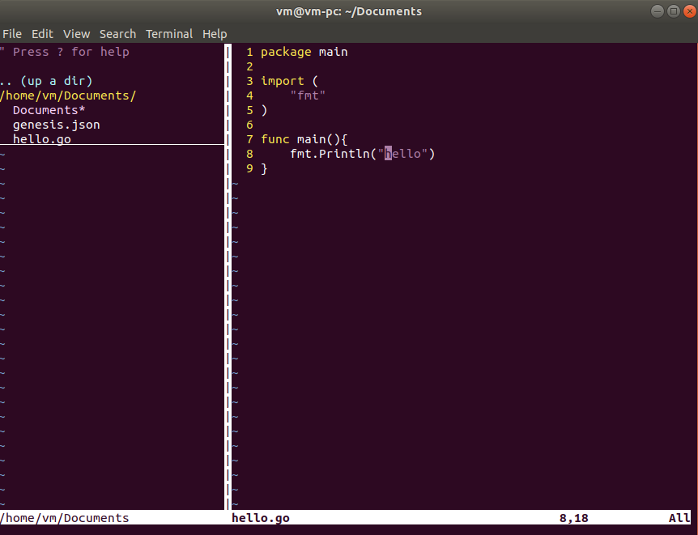

# True链开发准备篇-环境搭建（VSCode & Vim）
###### 作者：程阳	审阅：

本文主要介绍Ubuntu环境下怎么通过VSCode编译运行TrueChain和如何将Vim配置成一个强大的开发工具。CentOS，RHEL等不同发布版本的Linux安装方法基本一致，可作参考。

GoLang 的安装和使用没有作介绍，请参考
- 苹果开发环境搭建(https://github.com/truechain/wiki/blob/master/developer/1.mac_env_build.md)
- Window环境搭建(https://github.com/truechain/wiki/blob/master/developer/2.window_env_build.md)

每个人的喜好不同，选择自己喜欢的编辑器或者IDE就可以。

## 系统版本： Ubuntu 18.04
> **注：**
>
> **1. 不同Linux发布版本安装过略有所不同，CentOS，RHEL 安装过程中使用“yum”代替“apt-get”。**
>
> **2. 本教程中演示的Ubuntu版本比较新，低版本的Ubuntu安装过程中的输出可能会稍有不同**

#### 准备工作
先安装一些工具
```
$ sudo apt-get install cmake
$ sudo apt-get install python-dev python3-dev
$ sudo apt-get install build-essential
```

## VSCode 安装

#### 所需工具
1. Visual Studio Code

#### 安装VSCode

首先，下载安装包，下载地址[https://code.visualstudio.com/](https://code.visualstudio.com/)在Linux下打开该页面会直接显示Linux安装包的下载页面。如下图：



我是Ubuntu系统，所以下载.deb文件，下载的文件名为“code_1.26.1-1534444688_amd64.deb”（不同版本可能会有不同）。下边开始安装：
```
$ cd path/to/deb_file		// 进入deb文件所在目录
$ sudo dpkg -i code_1.26.1-1534444688_amd64.deb 	// 开始安装
```

安装成功如下图：



然后，有两种方法打开VSCode：
1. 在终端里输入
```
$ nohup code & 	// 不要忘记“&”，不然终端一退出，窗口就会关了
```
2. 按 “Win” 键，在所有程序里边搜索 “vscode” 就可以找到他了。

然后就安装各种扩展了，在扩展栏里搜索“chinese”，第一个就是中文包，需要的可以安装。安装完成后重启软件即可。


然后搜“Go”，安装Go的扩展。

然后VSCode的安装就完成了。

#### 使用VSCode编译TrueChain

这个过程和Windows几乎一致，只是有一些小差异。

先下载代码:
```
$ cd $GOPATH/src/truechain
$ git clone https://github.com/truechain/truechain-engineering-code.git
```

使用VSCode打开truechain-engineering-code所在文件夹。

然后按照提示安装依赖包，安装依赖包的时候也会像Windows一样提示安装不成功，如下图：


但是并不影响运行源码。所以这些包应该是装Go扩展的时候统一装的，并不是项目需要。

** （可选）不安装这些包并不会影响后边的操作。 **

这里可以选择处理一下他们，毕竟完美主义者，眼里容不下 FAILED

处理方法：手动安装

1. 先处理“golang.org\x\tools”里边没安装成功的

随意找个目录，然后把tools所有代码都下下来：
```
$ git clone https://github.com/golang/tools.git
```

然后，按照提示的安装失败的路径，把对应的文件夹复制到“$GOPATH/src/golang.org/x/tools”下边。

比如，报错“Installing golang.org/x/tools/cmd/gorename FAILED”，就
```
$ cp -r cmd/gorename $GOPATH/src/golang.org/x/tools/cmd/gorename
```

然后执行：
```
$ sudo go install golang.org/x/tools/cmd/gorename
```
安装成功没有任何输出，然后你在重新打开VSCode再安装依赖包的时候，就会发现没有这一项了。其他tools没安装都按这个步骤来，不再赘述。

2. 再处理github.com类没安装成功的

其实，也是从github上先下载，再安装就行，举个例子。解决这个报错吧，“Installing github.com/ramya-rao-a/go-outline FAILED”

```
$ cd $GOPATH/src/github.com
$ git clone https://github.com/ramya-rao-a/go-outline.git
// 下载完成后
$ go install github.com/ramya-rao-a/go-outline
```

OK，这样VSCode的安装就完成了。

也可以测试一下：

写一个test.go
```
package main

import (
	"fmt"
)

func main() {
	fmt.Println("Hello, TrueChain")
}
```
然后F5，输出"Hello, TrueChain"就是对了。

** 继续编译TrueChain。 **

** Linux下VSCode不会弹出“lanuch.json”文件，而是直接运行起来了，而且不报错，但是不配置该文件的运行参数，F5运行时虽然没有报错，但是并没有进行初始化，其实是有问题的 **

> 注：这里不敢肯定其他人运行的时候会不会弹出“lanuch.json”文件，只是我的没有像Windows一样弹出来

打开“调试->打开配置”就打开了“lanuch.json”文件
修改参数：
```
{
    // 使用 IntelliSense 了解相关属性。
    // 悬停以查看现有属性的描述。
    // 欲了解更多信息，请访问: https://go.microsoft.com/fwlink/?linkid=830387
    "version": "0.2.0",
    "configurations": [
        {
            "name": "Launch",
            "type": "go",
            "request": "launch",
            "mode": "auto",
            "remotePath": "",
            "port": 2345,
            "host": "127.0.0.1",
            "program": "${fileDirname}",
            "env": {},
            "args": ["init", "./genesis.json"],		// 主要修改这里
            "showLog": false
        }
    ]
}
```

** （可选）或者，按照README里的，写一个genesis.json文件，然后第二个参数把路径指向这个文件也可以： **
```
{
  "config": {
        "chainId": 10,
        "homesteadBlock": 0,
        "eip155Block": 0,
        "eip158Block": 0
    },
  "alloc"      : {
	  "0x970e8128ab834e8eac17ab8e3812f010678cf791" : { "balance" : 90000000000000000000000},
	  "0x68f2517b6c597ede0ae7c0559cdd4a84fd08c928" : { "balance" : 10000000000000000000000}
	  },
  "coinbase"   : "0x0000000000000000000000000000000000000000",
  "difficulty" : "0x200",
  "extraData"  : "",
  "gasLimit"   : "0x2fefd8",
  "nonce"      : "0x0000000000000042",
  "mixhash"    : "0x0000000000000000000000000000000000000000000000000000000000000000",
  "parentHash" : "0x0000000000000000000000000000000000000000000000000000000000000000",
  "timestamp"  : "0x00"
}
```
然后，在“cmd/getrue/main.go”上F5就可以初始化了。初始化成功如下图：


继续修改“lanuch.json”的“args”参数为
```
"args":["--nodiscover", "--mine", "--etherbase", "8a45d70f096d3581866ed27a5017a4eeec0db2a1"],
```
再F5就可以挖矿了。运行成功如下图，有时候可能不太一样：


#### 常见问题
1. 报错:
```
Fatal: Failed to write fast genesis block: database already contains an incompatible genesis block (have 1acaa8c23f22e0ae, new bc72c21faf0bc5b9)
```


你肯定是在配置“lanuch.json”的“args”参数之前，按下了F5，执行以下命令即可：
```
$ rm -rf ~/.truechain/
```

***

## 将Vim打造成一款强大的编辑器

## 慎入！！！

以下假定读者已具备Vim基本操作能力，否则请跳过。

## 简述

Vim被称为编辑器之神，是公认的最强大的编辑器没有之一，是Vi的升级版，自带的大量快捷键能能够满足绝大多数编辑需求，同时可以安装各种插件使其更加强大。但是，入手门槛比较高，如果不感兴趣，不要强求。否则，会把你折磨到怀疑人生。

其实现在很多好用的IDE都提供的有Linux版本，比如GoLand，VSCode，Eclipse，我只是更偏爱Vim，使用Vim能使我在编程的过程中更专注，而且他的快捷键比使用鼠标操作更高效。另外还有Emacs，被称为神之编辑器，通过各种插件甚至可以将其配置成一个小型操作系统，有兴趣的可以尝试。

再次强调，慎入！！！

## Vim配置

目前只为Vim增加三个最常用功能：
1. 自动补全
2. 文件目录
3. 代码折叠
其他功能可以根据自己喜好，自行查找插件。

#### 所需工具
1. Vim
2. Vundle - 用来管理Vim插件的插件
3. NERDTree - Vim插件，用于显示文件目录
4. YouCompleteMe - Vim插件，一个超级强大的自动补全插件

#### 首先，安装Vim
```
$ sudo apt install vim
```

Vim需要编写配置文件，先把官方的示例配置文件拷贝到“~/.vimrc”：
进入vim命令行模式进行操作：
先按“Esc”，然后“:”，输入以下命令：
```
:!cp $VIMRUNTIME/vimrc_example.vim ~/.vimrc
```

然后查看“$HOME/.vimrc”文件是否存在。不存在就再执行一次上边的命令，并自己排查原因。如果存在就先增加一些基础配置：
```
" 设置缩进为4个空格
set tabstop=4
set shiftwidth=4
set expandtab

" 显示行号
set nu

" 解决打开某些中文文档为的乱码问题
set fileencoding=utf-8
set fileencodings=ucs-bom,utf-8,gb2312,gbk,gb18030
set termencoding=utf-8
set encoding=utf-8

" 打开文当时自动折叠代码
set fdm=indent
```

继续执行下边的命令，使之生效：
```
:source ~/.vimrc		// 或者重启Vim也可以使之生效
```

> 注：每次修改配置文件都要按以上方式使配置生效

现在基本的配置已经完成了，后边需要安装一些插件让我们编程的时候更方便。

#### 然后，安装Vundle

参考： [https://github.com/VundleVim/Vundle.vim#quick-start](https://github.com/VundleVim/Vundle.vim#quick-start)

先下载Vundle源码：
```
git clone https://github.com/VundleVim/Vundle.vim.git ~/.vim/bundle/Vundle.vim
```

然后在Vim配置文件“.vimrc”最上边中加入如下配置：
```
""""""""""""""" Vundle configuration"""""""""""""""""
set nocompatible              " be iMproved, required
filetype off                  " required

" set the runtime path to include Vundle and initialize
set rtp+=~/.vim/bundle/Vundle.vim
call vundle#begin()
" alternatively, pass a path where Vundle should install plugins
"call vundle#begin('~/some/path/here')

" let Vundle manage Vundle, required
Plugin 'VundleVim/Vundle.vim'

" The following are examples of different formats supported.
" Keep Plugin commands between vundle#begin/end.
" plugin on GitHub repo
Plugin 'tpope/vim-fugitive'
" plugin from http://vim-scripts.org/vim/scripts.html
" Plugin 'L9'
" Git plugin not hosted on GitHub
Plugin 'git://git.wincent.com/command-t.git'
" git repos on your local machine (i.e. when working on your own plugin)
Plugin 'file:///home/gmarik/path/to/plugin'
" The sparkup vim script is in a subdirectory of this repo called vim.
" Pass the path to set the runtimepath properly.
Plugin 'rstacruz/sparkup', {'rtp': 'vim/'}
" Install L9 and avoid a Naming conflict if you've already installed a
" different version somewhere else.
" Plugin 'ascenator/L9', {'name': 'newL9'}

" All of your Plugins must be added before the following line
call vundle#end()            " required
filetype plugin indent on    " required
" To ignore plugin indent changes, instead use:
"filetype plugin on
"
" Brief help
" :PluginList       - lists configured plugins
" :PluginInstall    - installs plugins; append `!` to update or just :PluginUpdate
" :PluginSearch foo - searches for foo; append `!` to refresh local cache
" :PluginClean      - confirms removal of unused plugins; append `!` to auto-approve removal
"
" see :h vundle for more details or wiki for FAQ
" Put your non-Plugin stuff after this line

"""""""""""""""END Vundle configuration"""""""""""""""""
```

然后打开命令行输入：
```
$ vim
```

进入Vim，同时没有报错就说明配置文件没有问题。

然后，安装Vundle，在命令行模式下输入：
```
:PluginInstall
```

安装过程如下图：



#### 然后，安装YouCompleteMe

先下载源码：
```
$ git clone https://github.com/Valloric/YouCompleteMe.git ~/.vim/bundle/YouCompleteMe
$ cd ~/.vim/bundle/YouCompleteMe
$ git submodule update --init --recursive 	// 下载关联的子模块
```

然后编译
```
$ cd ~/.vim/bundle/YouCompleteMe
$ ./install.py --go-completer		// 可以选择支持不同语言的语言，请参照这里[https://github.com/Valloric/YouCompleteMe#ubuntu-linux-x64](https://github.com/Valloric/YouCompleteMe#ubuntu-linux-x64)
```

然后需要在“.vimrc”中加入以下“YouCompleteMe”的配置，并使“.vimrc”生效就可以使用自动补全了
```
"""""""""""""YouCompleteMe""""""""""""""""""""""""""""""""""
set runtimepath+=~/.vim/bundle/YouCompleteMe
let g:ycm_collect_identifiers_from_tags_files = 1           " 开启 YCM 基于标签引擎
let g:ycm_collect_identifiers_from_comments_and_strings = 1 " 注释与字符串中的内容也用于补全
let g:syntastic_ignore_files=[".*\.py$"]
let g:ycm_seed_identifiers_with_syntax = 1                  " 语法关键字补全
let g:ycm_complete_in_comments = 1
let g:ycm_confirm_extra_conf = 0
"let g:ycm_key_list_select_completion = ['<c-n>', '<Down>']  " 映射按键, 没有这个会拦截掉tab, 导致其他插件的tab不能用.
"let g:ycm_key_list_previous_completion = ['<c-p>', '<Up>']
let g:ycm_complete_in_comments = 1                          " 在注释输入中也能补全
let g:ycm_complete_in_strings = 1                           " 在字符串输入中也能补全
let g:ycm_collect_identifiers_from_comments_and_strings = 1 " 注释和字符串中的文字也会被收入补全
let g:ycm_global_ycm_extra_conf='~/.vim/bundle/YouCompleteMe/third_party/ycmd/cpp/ycm/.ycm_extra_conf.py'
let g:ycm_show_diagnostics_ui = 0                           " 禁用语法检查
inoremap <expr> <CR> pumvisible() ? "\<C-y>" : "\<CR>" |            " 回车即选中当前项
nnoremap <c-j> :YcmCompleter GoToDefinitionElseDeclaration<CR>|     " 跳转到定义处
let g:ycm_min_num_of_chars_for_completion=2                 " 从第2个键入字符就开始罗列匹配项

""""""""END YouCompleteMe"""""""""""""""""""""""""""""""""""
```

代码补全的效果如下：



#### 然后，安装NERDTree

先下载源码：
```
$ git clone https://github.com/scrooloose/nerdtree.git ~/.vim/bundle/nerdtree
```

然后将以下配置添加到“.vimrc”的“call vundle#begin()”和“call vundle#end()”之间：
```
Plugin 'https://github.com/scrooloose/nerdtree.git'
```

在“.vimrc”的最后添加以下配置：
```
""""""""NERDTree""""""""""""""""""""""""""""""""""""""""""""

let g:NERDTreeDirArrows = 1
let g:NERDTreeDirArrowExpandable = '▸'
let g:NERDTreeDirArrowCollapsible = '▾'
let g:NERDTreeGlyphReadOnly = "RO"
autocm vimenter * NERDTree

""""""""END NERDTree""""""""""""""""""""""""""""""""""""""""
```

使配置文件“.vimrc”生效。

重启Vim之后的效果如下图：



完整“.vimrc” 配置文件地址：[https://github.com/stone-ch/myVIMRC/blob/master/.vimrc](https://github.com/stone-ch/myVIMRC/blob/master/.vimrc)
